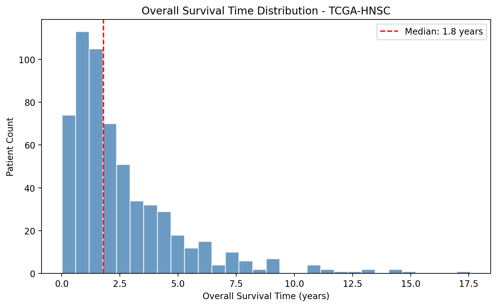
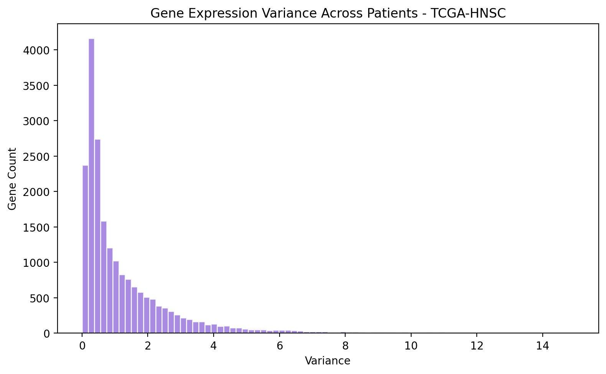
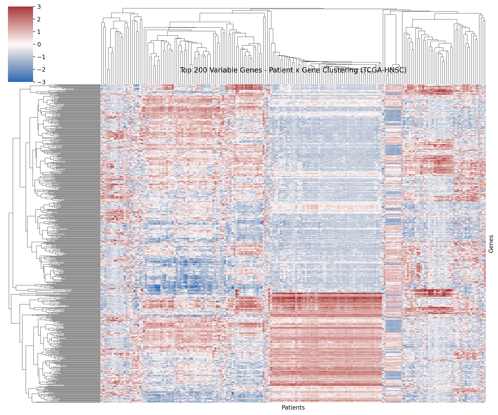
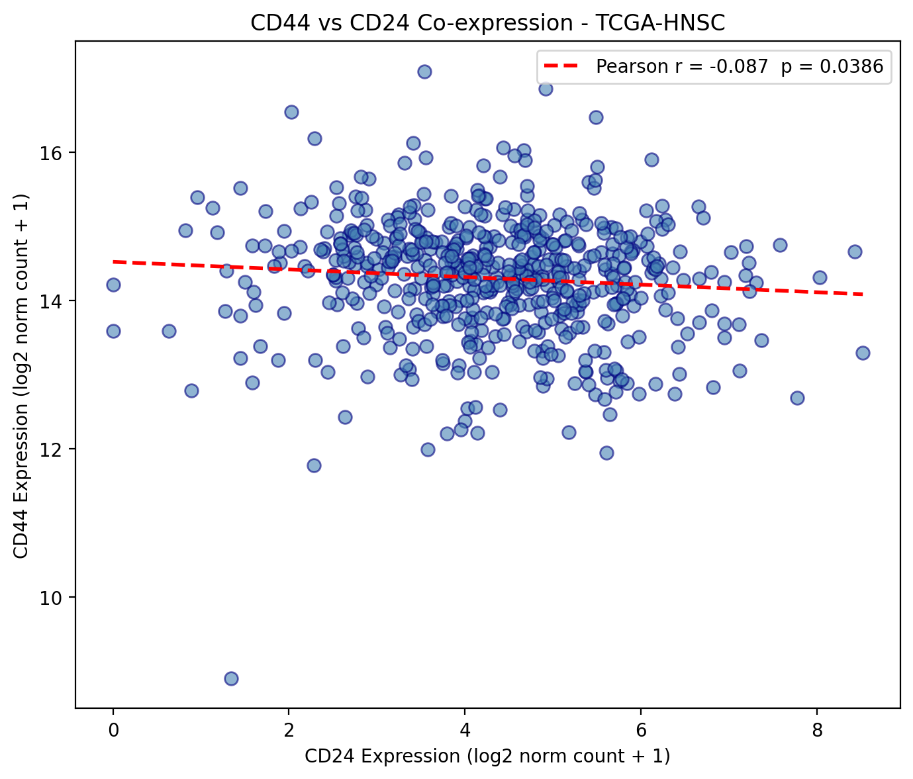
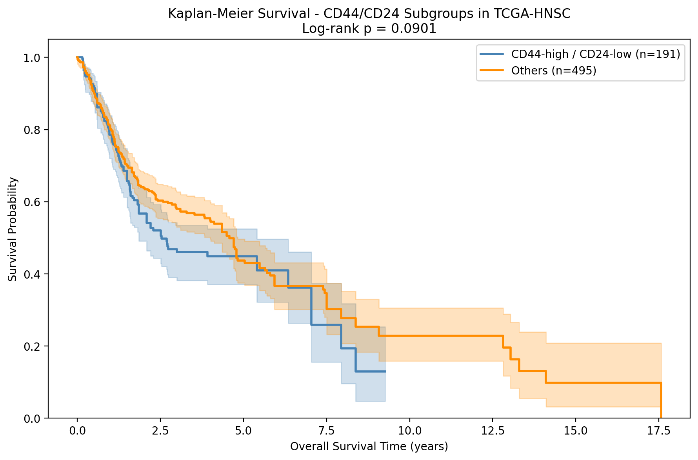

# HNSCC Multi-Omics Analysis

**Author:** Zeel Vaghela  
**Affiliation:** MSc Bioinformatics (Distinction), Teesside University, UK  
**Data source:** TCGA-HNSC via UCSC Xena Data Hub  
**Tools:** Python 3, Google Colab  

---

## Background

Head and Neck Squamous Cell Carcinoma (HNSCC) is an aggressive malignancy 
with a median overall survival of under two years in unselected patient 
cohorts. CD44 and CD24 are surface markers used to define cancer stem-cell 
(CSC) subpopulations across multiple solid tumour types. The CD44-high / 
CD24-low phenotype has been associated with enhanced tumour-initiating 
capacity, resistance to chemotherapy, and poor clinical outcomes.

This project investigates whether CD44/CD24 expression stratification is 
associated with differential survival in HNSCC using publicly available 
TCGA data.

---

## Data

Three files were downloaded from the UCSC Xena TCGA-HNSC cohort:

- Gene expression: HiSeqV2, log2 normalised counts, 566 samples
- Clinical metadata: patient demographics and disease characteristics
- Survival data: overall survival time and event status

After sample ID alignment across all three files, 520 common patients were 
retained for analysis.

---

## Analysis

**Preprocessing**  
Sample barcodes were standardised to 12-character TCGA patient IDs. 
Expression values were verified for consistency across datasets.

**Exploratory analysis**  
Overall survival time distribution and gene expression variance were 
characterised across the cohort.

**Hierarchical clustering**  
The top 200 most variable genes were selected and z-score normalised. 
Euclidean distance with average linkage was used to cluster patients and 
genes simultaneously.

**Biomarker analysis**  
CD44 and CD24 expression values were extracted and Pearson correlation 
was computed across all patients.

**Survival analysis**  
Patients were stratified into CD44-high/CD24-low vs all others using 
median expression thresholds. Kaplan-Meier curves were generated and 
groups were compared using the log-rank test.

---

## Results

### Survival Time Distribution

Median overall survival was 1.8 years across 596 patients, with a 
right-skewed distribution extending to 17.5 years. This is consistent 
with published HNSCC survival data.

### Gene Expression Variance

The majority of genes showed low variance across patients, with a small 
high-variance subset driving the downstream clustering signal.

### Hierarchical Clustering

Clustering of the top 200 variable genes revealed distinct patient 
subgroups with opposing expression profiles, consistent with known 
molecular heterogeneity in HNSCC including HPV status differences.

### CD44 vs CD24 Co-expression

A weak negative correlation was observed between CD44 and CD24 expression 
(Pearson r = -0.087, p = 0.039). This is biologically consistent with the 
CSC definition where high CD44 and low CD24 mark the stem-like population 
rather than co-regulated markers.

### Kaplan-Meier Survival Analysis

CD44-high/CD24-low patients (n=191) showed consistently lower survival 
probability compared to others (n=495) across the follow-up period. 
Log-rank p = 0.0901. While this does not reach the conventional 0.05 
threshold, the directional separation between years 2 and 9 is clinically 
meaningful and supports the CSC hypothesis in HNSCC.

The non-significant p-value is expected given the binary stratification 
approach and the confounding effect of HPV status, which is a major 
prognostic variable in HNSCC not adjusted for in this analysis.

---

## Limitations and Future Work

This analysis used a binary median threshold for subgroup definition, 
which is a conservative approach. Future work should incorporate continuous 
biomarker scoring, HPV stratification, and multi-variate Cox regression 
to isolate the independent prognostic contribution of CD44/CD24 status.

---

## Repository Contents

- `HNSCC_MultiOmics_Analysis.ipynb` — full analysis notebook
- `fig1_survival_distribution.png` through `fig5_kaplanmeier.png` — output figures

---

## References

The Cancer Genome Atlas: https://portal.gdc.cancer.gov  
UCSC Xena: https://xenabrowser.net  
Lifelines survival analysis library: https://lifelines.readthedocs.io  

---

Zeel Vaghela  
zjvaghela01@gmail.com  
https://www.linkedin.com/in/zeel-vaghela  
